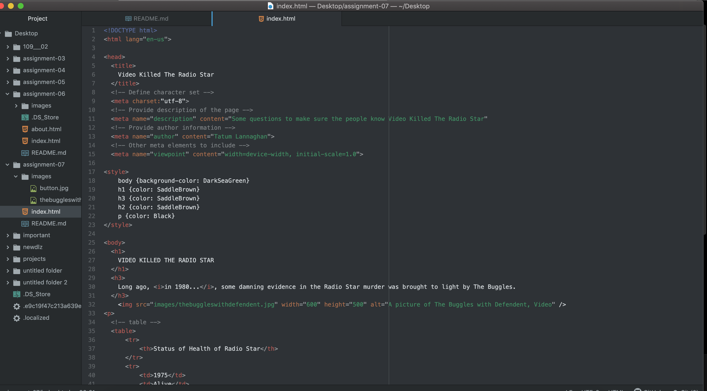
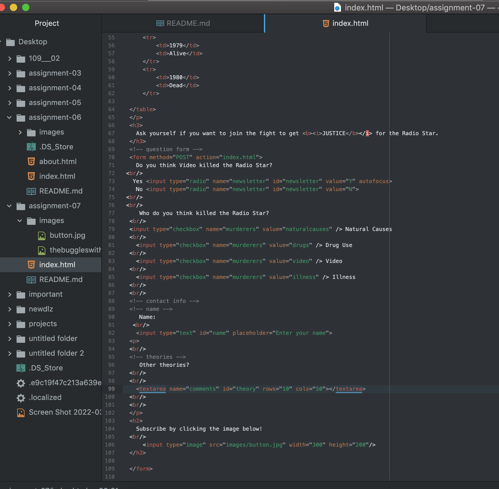

In your README.md file, please describe any forms you've come across while browsing the web. What purposes do they serve?

Forms i've discovered while browsing the web are usually contact forms for website to either get signed up for a newsletter or leave a comment for a product or ask a question.
