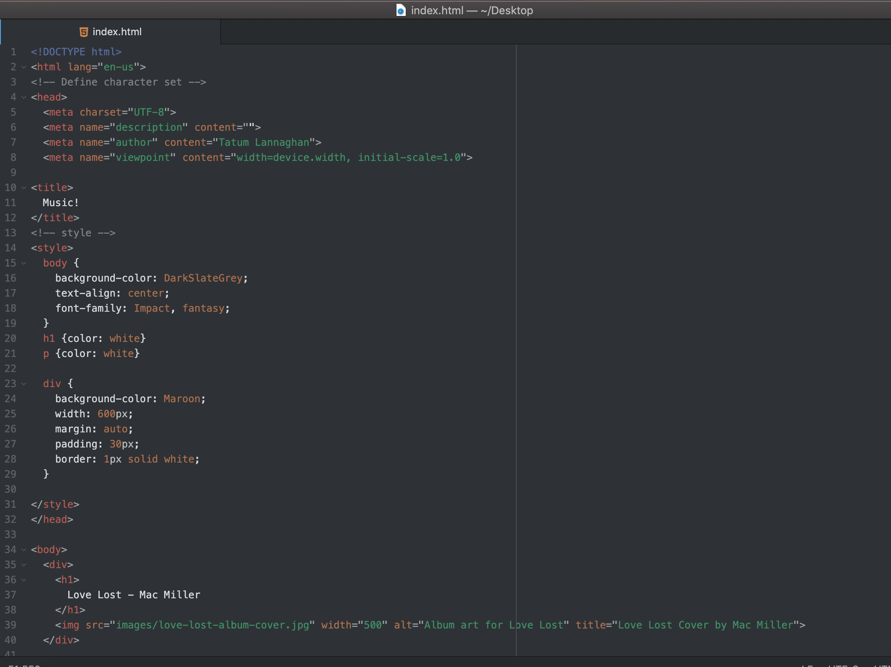
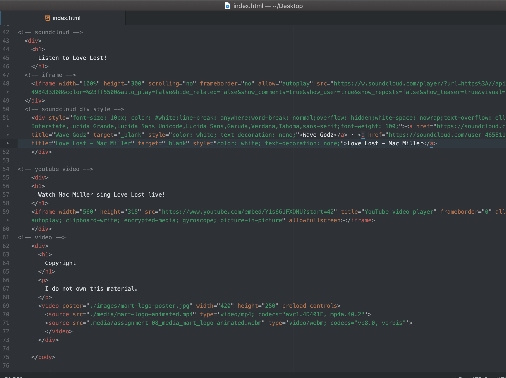

In your README.md file, please answer the following questions:

What is an affordance?

Hosting your own media takes up bandwidth which can cost a lot of money. You can use a third-party host or service in order to be more affordable.

What are the advantages and disadvantages of using a third-party service like YouTube or Vimeo to host your videos?

Advantages of third-party services are that they can host high-quality large files, good for audio and video files, easy to incorporate by clicking the embed button and pasting.
Disadvantages of third-party services are that if you used unlicensed materials without granted permission it can be reported.
