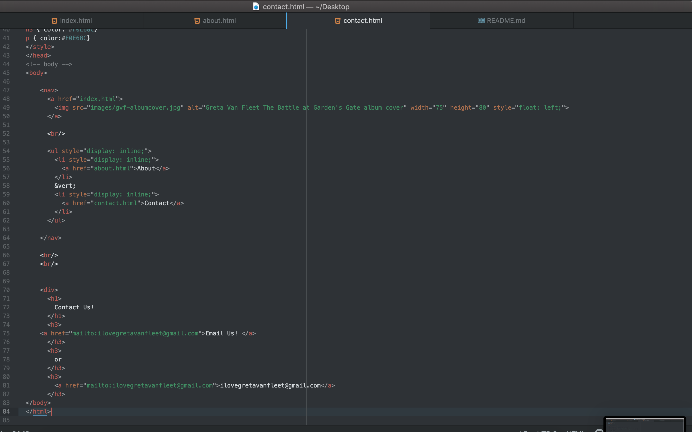

In your README.md file, please do the following:

Briefly recap your experience learning HTML. What was old, new, interesting, or difficult to learn?
Learning HTML was mostly new to me. I find it pretty easy to work with and if there is something I messed up on it is easy to go through and edit certain parts of the code to see what is missing.

After we come back from spring break we will start to dive into CSS and expand on styling, which helps us "decorate" HTML. Is there anything you're anxious or excited to learn about in this new section?
I'm really excited for expanding into the styling part of code!! Not feeling anxious just ready to go!
