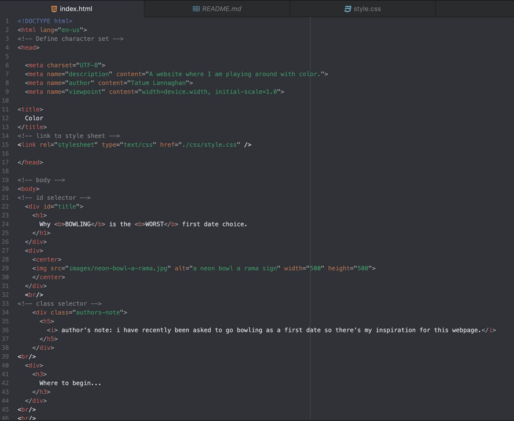
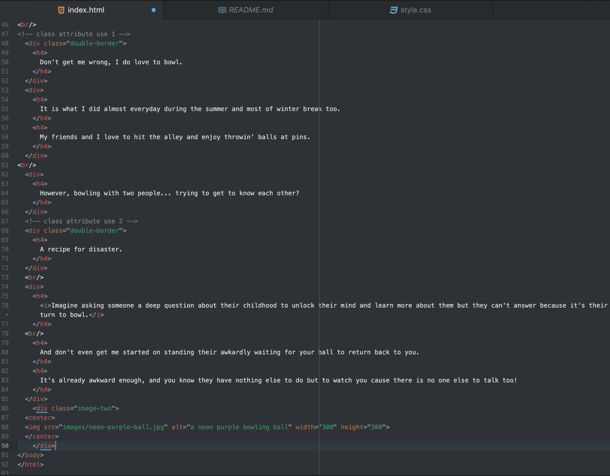
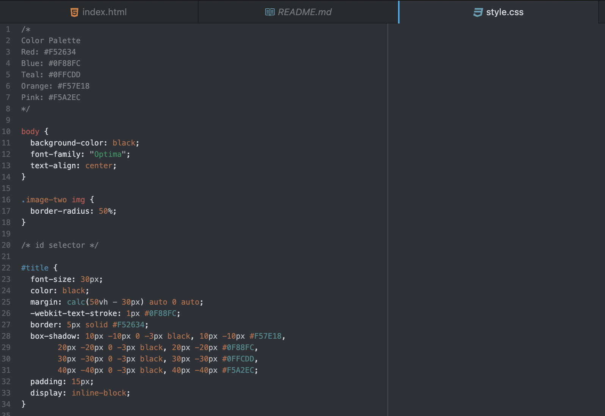
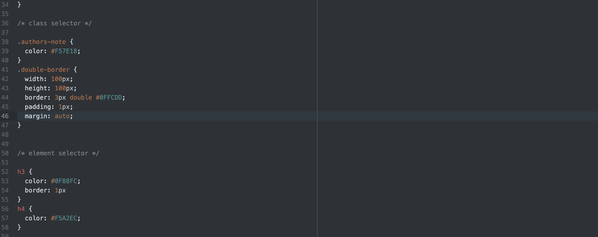

Describe the difference between the universal, element, class, and id selector types. When might you choose one over the other to style content?

Universal selectors are used to style every element on the page, you would use this when you want to make all elements on the page look the same and uniformed. Element selectors are used to select elements of a certain type, you would use this if you wanted certain elements to look different, like having your h1 be a different font from your h2. Class selectors are used for elements that serve the same function, you would use this on things like different elements you want to look the same while keeping the other elements another way. ID selectors are similar to class selectors.

Discuss your color palette. How did you choose your colors?

I chose my colors after I found the image I wanted to use for my webpage. I picked that image based on its colors because I thought it had a bowling alley essence to it.

Optional: discuss any challenges you faced this week, and how you overcame them.

I had a lot of fun this week! I wanted to get creative with it so I looked up fun borders and added the multi level box border for my h1 element. I thought it added a lil spice and introduced my color palette as well. 
