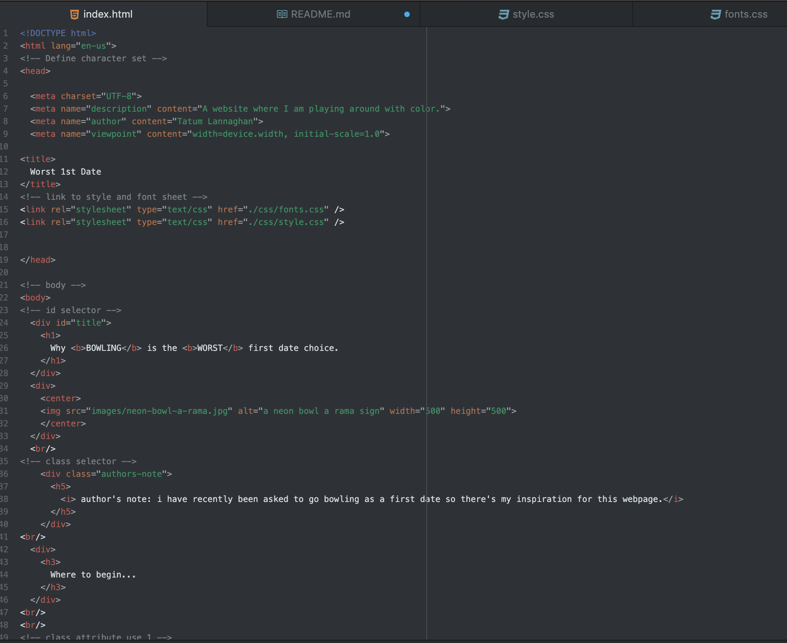
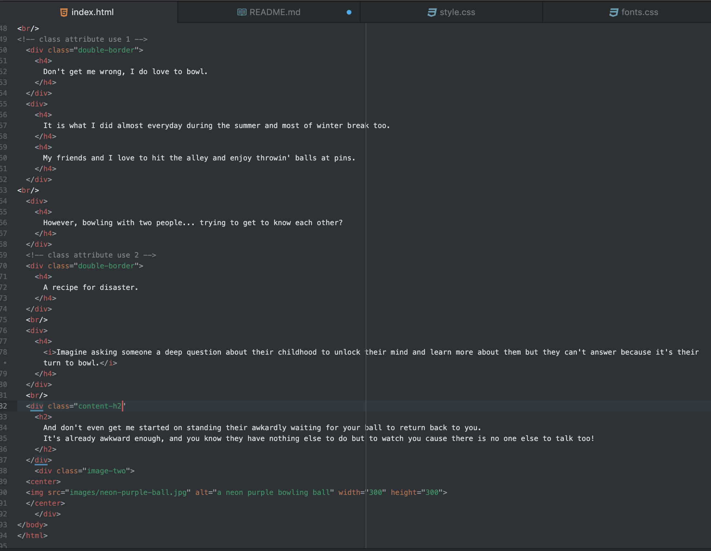
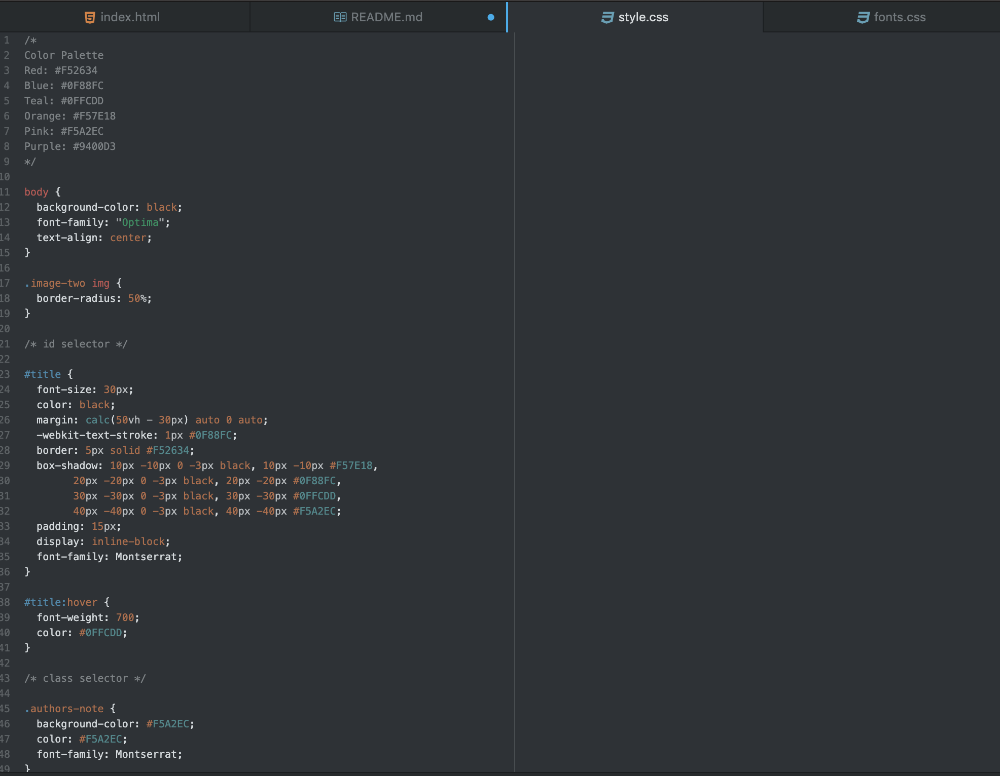
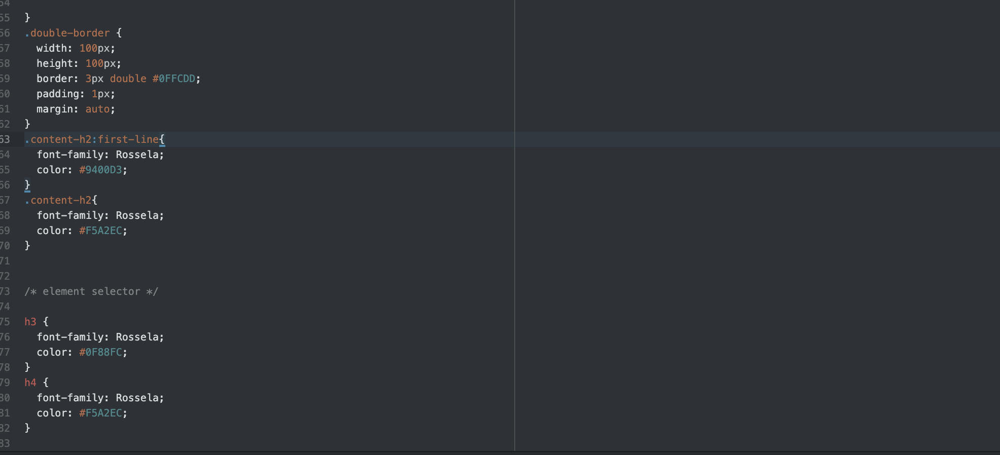
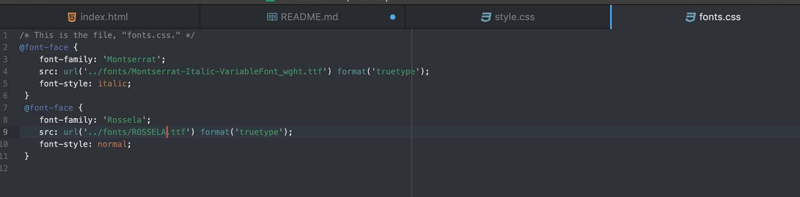

What is typography?
Typography is the technique and art of arranging type to make written language appealing, legible, and readable.

What is the importance of having fallback fonts or a font stack?
There isn't a font that is completely web safe, fallback fonts are a list of similar fonts incase the first one isn't supported the browser it will try the next one.

What is the difference between a system font, web font, and web-safe font?
System fonts are fonts already installed on your computer, web fonts are fonts used for building a website and downloaded, web-safe fonts are fonts that can adapt to any browser used on any device.
