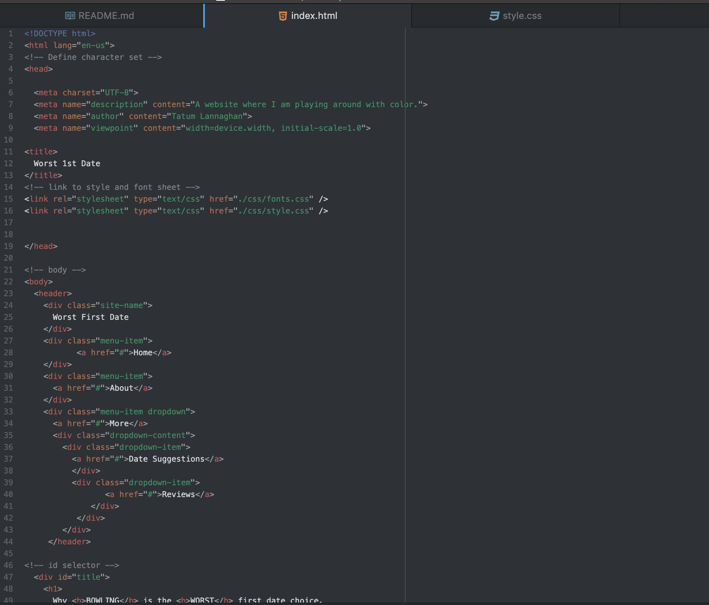
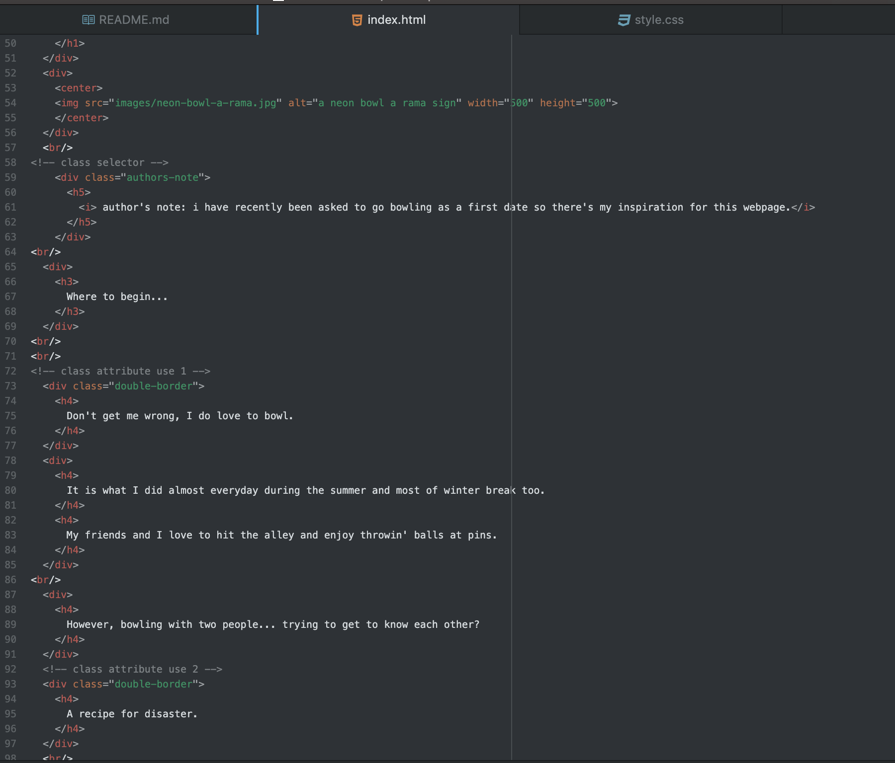
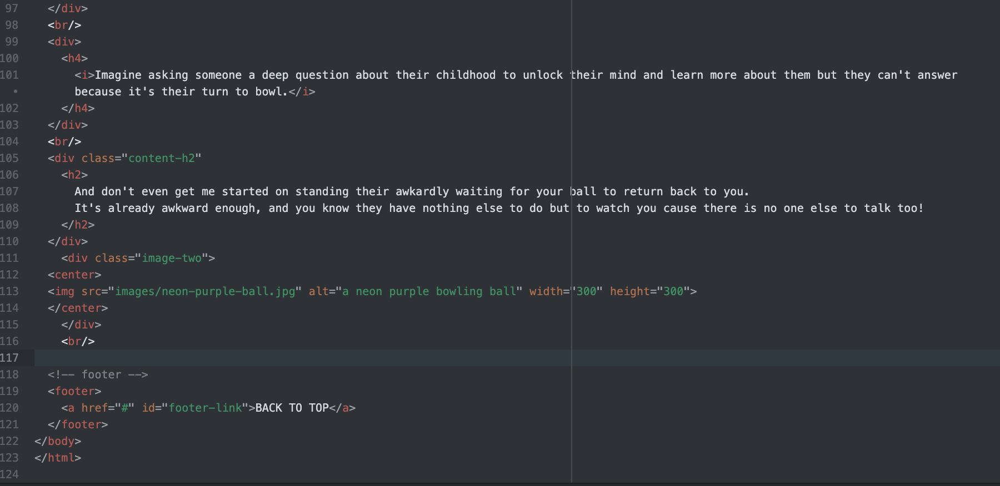
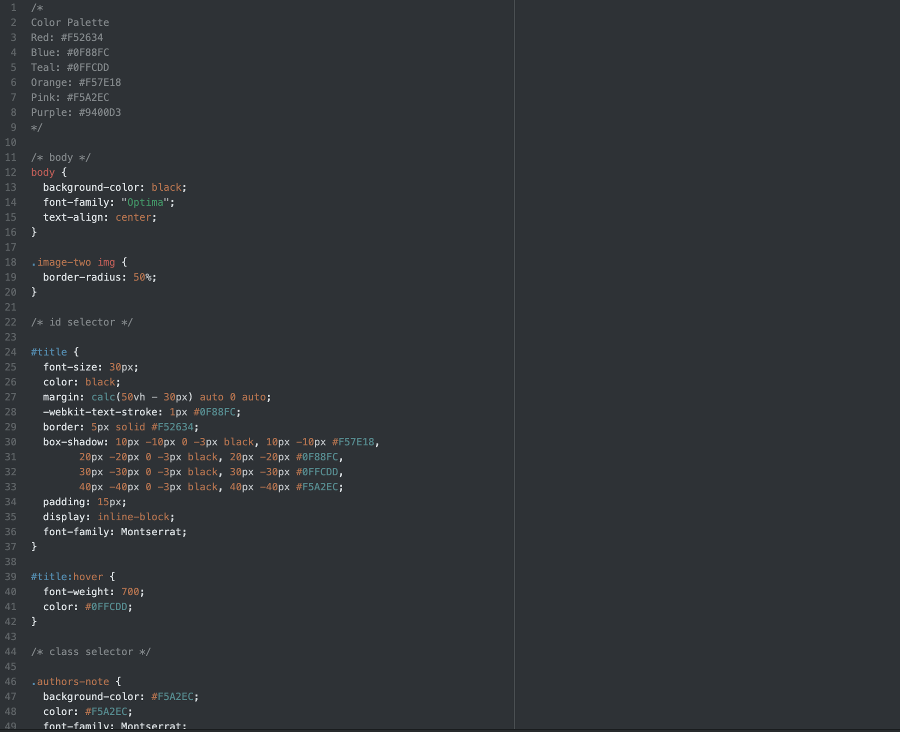
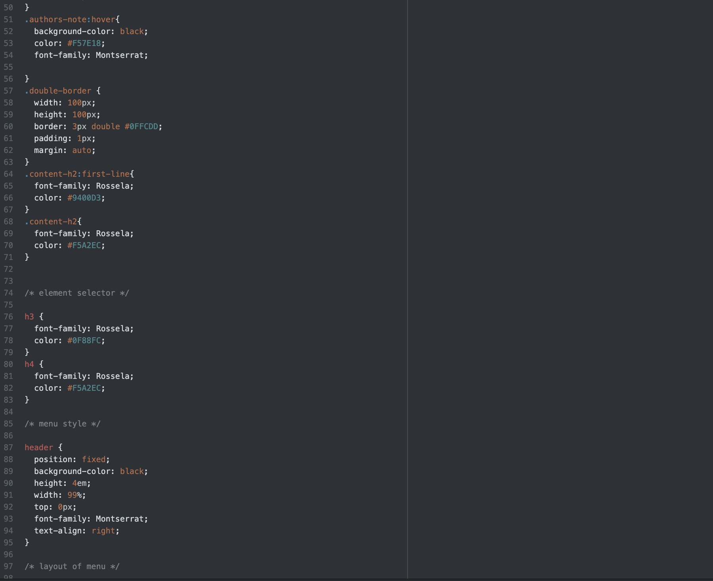
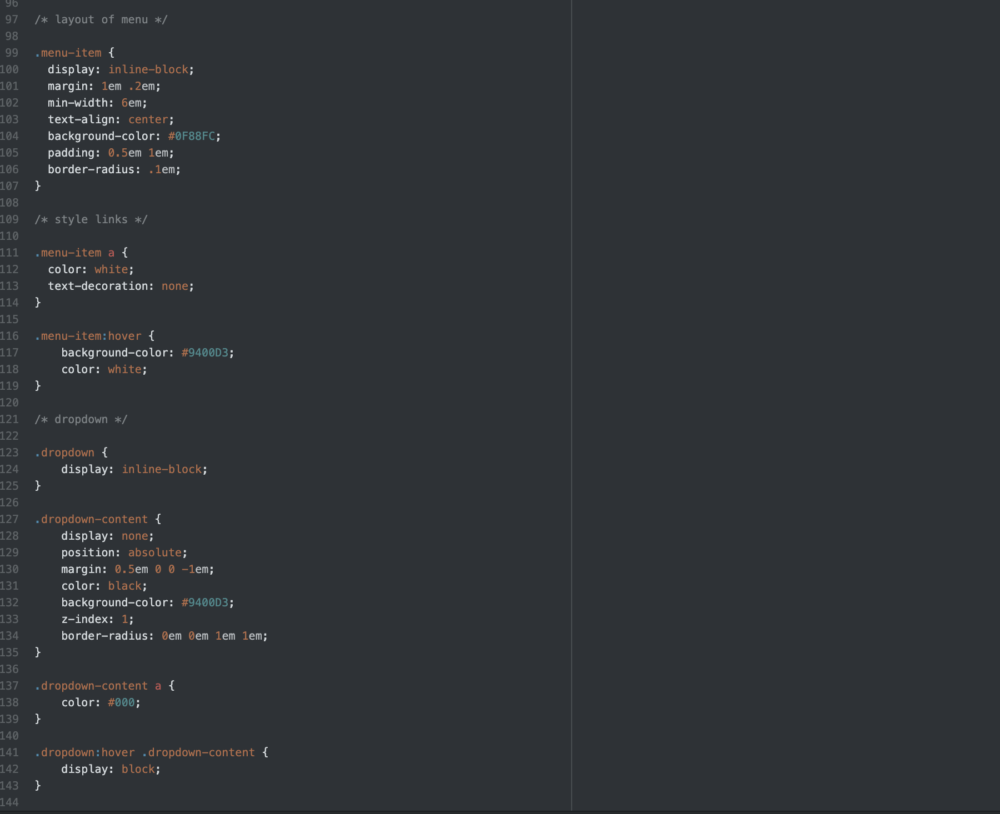
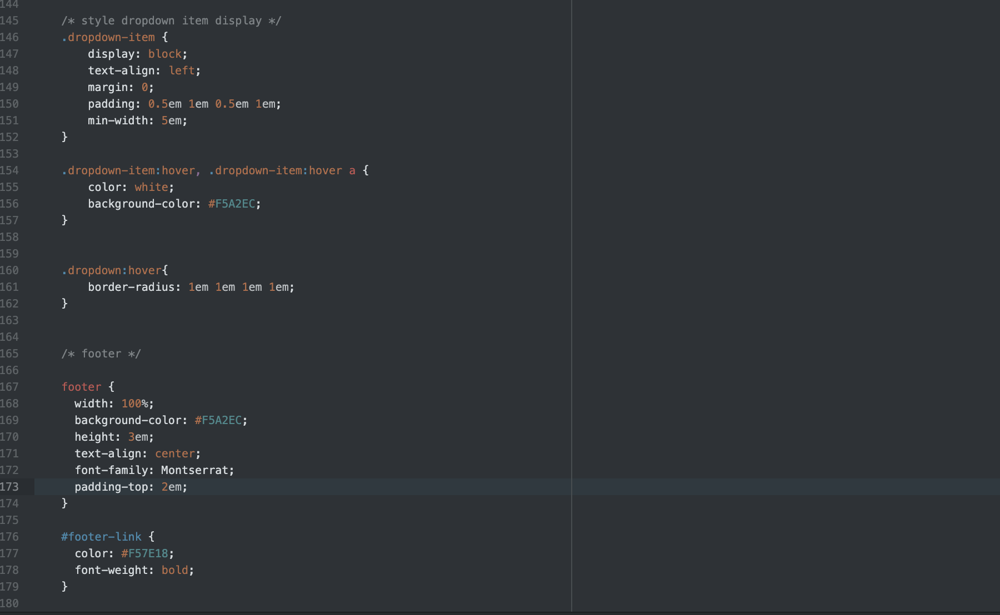

What is the difference between padding, margin, and borders?
Padding is the amount of space between the inside content of an element and the element itself, margin is the space between the element and other elements, and borders is the relationship to other elements and the amount of space the element takes up.

Optional: how did this week's assignment go? What challenges did you face, and how did you overcome them?
I found this week's assignment pretty easy to understand thanks to the previous lessons!!
